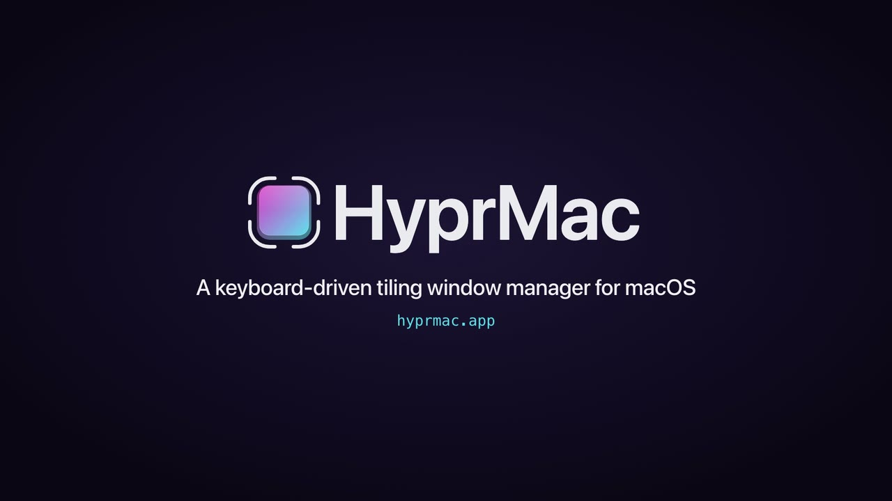

# HyprMac

> [!WARNING]
> **This is an experimental fork** ([upstream: zacharytgray/HyprMac](https://github.com/zacharytgray/HyprMac)) used to try out some opinionated ideas — starting with Hyprland-style window rules. It builds as **HyprMacExperiments** with its own bundle ID, its own config directory (`~/Library/Application Support/HyprMacExperiments/`, iCloud folder and IPC sockets included) so it can be installed and switched with a regular HyprMac install without the two ever sharing state — the first launch copies an existing HyprMac config over once. Auto-updates are disabled, and there is no stability promise: features may change or disappear without notice.

**A keyboard-driven tiling window manager for macOS, inspired by [Hyprland](https://hyprland.org).**
Free, open source, and the first real job your Caps Lock key has ever had.

[](https://hyprmac.app/hyprmac-demo-github.mp4)

**▶ [Watch the one-minute demo](https://hyprmac.app/hyprmac-demo-github.mp4)** ·
**[Try it in your browser](https://hyprmac.app/#try)** ·
**[hyprmac.app](https://hyprmac.app)**

## What it does

If your Mac usually looks like a pile of windows stacked on top of each other, and the one you
want is always at the bottom, HyprMac is for you.

- **Windows arrange themselves.** Open an app and it slots into a tidy tiled layout. No
  dragging, no resizing, no digging.
- **Your keyboard drives.** Hold Caps Lock, which becomes your **Hypr** key out of the box (there
  are a bunch of alternatives!), and tap an arrow to jump between windows. Add Shift to swap
  them. Tap a number to switch workspaces.
- **You can't get lost.** Forgot a shortcut? **Hypr + K** shows every one of them.

A handful of keys covers the basics, and most people have them down in a few minutes. When you
want more, every keybind is remappable and you can point keys at your own scripts.

## The five keys to know

| Keys | What happens |
|------|--------------|
| `Hypr + ←/→/↑/↓` | Move between windows |
| `Hypr + Shift + ←/→/↑/↓` | Swap windows around |
| `Hypr + 1–9` / `Hypr + 0` | Jump to workspace 1–9 / 10 |
| `Hypr + Return` | Open Terminal |
| `Hypr + K` | Show every keybind |

## Install

Homebrew:

```sh
brew trust --cask zacharytgray/hyprmac/hyprmac
brew install --cask zacharytgray/hyprmac/hyprmac
```

Homebrew refuses to load casks from third-party taps until you trust them. The first line trusts
only the HyprMac cask, which also lets `brew upgrade --cask hyprmac` work later.

Or grab the DMG: [HyprMac.dmg](https://github.com/zacharytgray/HyprMac/releases/latest/download/HyprMac.dmg),
open it, and drag HyprMac to Applications. Older versions live on the
[releases page](https://github.com/zacharytgray/HyprMac/releases).

Then follow the [install guide](https://hyprmac.app/guides/install/) for first-run setup,
permissions, and the recommended macOS settings.

### Requirements

- macOS 13 (Ventura) or later
- Accessibility permission, in System Settings → Privacy & Security → Accessibility. HyprMac uses
  the Accessibility APIs only, so there's no need to disable System Integrity Protection.
- For the default Caps Lock Hypr key: Caps Lock must stay set to **"⇪ Caps Lock"** in System
  Settings → Keyboard → Keyboard Shortcuts → Modifier Keys, not "No Action". The pane is per
  keyboard, so check each one you use. HyprMac remaps Caps Lock to F18 itself.
- The same holds if Control, Option, or Command is your Hypr key: leave it on its default
  there. Tab, backtick, backslash, F13–F20, and Shift are not in that pane and need nothing.
- macOS gives apps no way to read that setting, so HyprMac shows this as a reminder in
  onboarding and in Settings → Keys, with an Open Keyboard Settings button.

## For Hyprland folks

You'll feel at home. The differences are mostly macOS being macOS:

- **Tiling:** BSP dwindle, like Hyprland's default layout. New windows split the focused one,
  and **Hypr + J** flips the split direction. Drag a tiled window onto another tile's edge to
  insert it there, or hold Hypr while dragging to swap the two.
- **Workspaces:** ten of them (keys 1–9 and 0), plus a scratchpad and an overview on
  **Hypr + O**. macOS has no public API for this, so HyprMac keeps its own virtual workspaces and
  hides the other workspaces' windows when you switch.
- **Hypr + F:** native macOS fullscreen spawns its own Space and wrecks the layout, so HyprMac
  gives the window a dedicated empty workspace on its display instead.
- **Focus follows mouse:** there if you want it, with an adjustable hover rate.
- **Config:** everything, including the Hypr key itself, lives in Settings and is saved as JSON
  at `~/Library/Application Support/HyprMac/config.json`. The schema is in
  [Keybinds and actions](docs/keybinds-and-actions.md).
- **Your own tools:** Settings → Keys → Add → Command… binds a chord to any program or script.
  It runs directly, not through a shell, so keep pipes and redirects inside a script.

## All default keybinds

Everything below is configurable in Settings → Keys. The full reference lives at
[hyprmac.app/guides/keybinds](https://hyprmac.app/guides/keybinds/).

| Shortcut | Action |
|----------|--------|
| `Hypr + ←/→/↑/↓` | Focus window in direction |
| `Hypr + Shift + ←/→/↑/↓` | Swap window in direction |
| `Hypr + Ctrl + ←/→` | Move window to adjacent monitor |
| `Hypr + Ctrl + Shift + ←/→/↑/↓` | Resize focused window in direction |
| `Hypr + 1–9` / `Hypr + 0` | Switch to workspace 1–9 / workspace 10 |
| `Hypr + Shift + 1–9` / `Hypr + Shift + 0` | Move window to workspace 1–9 / workspace 10 |
| `Hypr + Tab` / `Hypr + Shift + Tab` | Cycle occupied workspaces on this monitor |
| `Hypr + F` | Move window to a dedicated workspace on its display |
| `Hypr + T` | Toggle floating and tiled |
| `Hypr + Shift + T` | Cycle focus through floating windows |
| `Hypr + J` | Toggle split direction |
| `Hypr + S` / `Hypr + Shift + S` | Toggle scratchpad / send window to scratchpad |
| `Hypr + W` | Close window |
| `Hypr + P` | Pause or resume tiling |
| `Hypr + K` | Show the keybind overlay |
| `Hypr + O` | Show workspace overview |
| `Hypr + Ctrl + S` / `Hypr + Ctrl + R` | Save / restore the layout for this display setup |
| `Hypr + M` | Collapse onto a single screen for screen sharing, and back *(fork)* |
| `Hypr + A` | Toggle accordion mode *(fork)* |
| `Hypr + Return` | Launch or focus Terminal |
| ``Hypr + ` `` | Warp the cursor to the menu bar |

## Saved layouts

**Hypr + Ctrl + S** saves which workspace each tiled window is on and how each workspace is
split, across every monitor, for the displays you have connected right now. **Hypr + Ctrl + R**
puts all of it back. Restore only moves windows that are open; it doesn't reopen closed apps,
and a saved window that isn't open is skipped. A HUD like the workspace switch one says whether
the layout was saved, restored, or only partly restored.

HyprMac also saves on its own just before your displays change, and restores when you return to
a display setup it has saved. To restore at launch too, turn on "Restore saved layout at launch"
in Settings → General.

Saved layouts stay on this Mac in `~/Library/Application Support/HyprMac/layout-snapshots.json`.
The file keeps window titles so it can tell windows apart. To clear it, quit HyprMac and delete
the file, plus `layout-snapshots.json.unreadable` if it exists. Setups with the same monitor
models at the same resolutions share one saved layout, however they are arranged.

## Fork features

What this fork adds on top of upstream HyprMac:

- 📌 **Window Rules** — Pin apps to workspaces and fix their tile sort order by bundle ID, Hyprland-style
- 🧷 **Sticky Apps** — Hyprland's `pin`, extended to tiles: chosen apps follow you across the workspaces that opt in
- 🏛 **Full-Height Apps** — Per-app guarantee of a full-height column in the dwindle layout, master-layout style
- 🔗 **Linked Monitors** — Toggle: all monitors show one workspace, tiles load-balanced across screens by size
- 🪗 **Accordion Mode** — AeroSpace-style stacked layout when only the chosen screen (default: built-in) is connected, with configurable side peek; the tiled layout is kept in the background and restored when monitors return
- 🔌 **IPC + sketchybar** — Hyprland-style event socket + `hyprmacctl`, clickable workspace indicators
- 🎨 **Workspace Identity** — Per-workspace accent colors and wallpapers
- 📐 **Per-Side Padding** — Top-only outer padding to reserve space for a status bar
- 🖥 **Screen-Sharing Toggles** — `Hypr+M` collapses the desktop onto one monitor (and back), `Hypr+A` flips accordion mode

---

### Window Rules *(fork feature)*

Hyprland-style per-app rules, modeled on `windowrule = <effect>, class:...`. Each rule is keyed by bundle ID and can apply two effects, independently or together:

- **Workspace pin** — when the app opens a new window, it is placed on its pinned workspace instead of the active one, and by default the workspace is switched to, so e.g. opening your terminal takes you straight to its workspace. Set `silent` to move the window without switching (Hyprland's `workspace N silent`).
- **Sort priority** — keeps the app's tiles at a fixed end of the dwindle order: higher priority tiles further **top-left**, lower further **bottom-right**, 0 (default) leaves the window in plain insertion order. So `"sortPriority": -1` on Mattermost means it always ends up in the rightmost tile, no matter which order your apps opened in. (Hyprland has no native equivalent — the request was [declined upstream](https://github.com/hyprwm/Hyprland/issues/5388) — but per-class window rules are the idiomatic place for it.)
- **Focus on activate** (`"focusOnActivate": true`, the UI's "Activate") — Hyprland's `focus_on_activate` / `windowrule = activate`, per app: always honor the app's activation requests and switch to its workspace even without a click or keystroke. By default, activations of apps with no visible window are honored only when a user gesture (recent click, recent ⌘ keystroke, or a launcher as the previous app) proves intent — a terminal self-raising when a background job prints must not yank the workspace. Set this on your browser so a URL opened from another app (an SSO login from the terminal, e.g.) still takes you there.

- **Sticky** (`"sticky": true`) — Hyprland's `windowrule = pin` ("show it on all workspaces"), per app. The app's windows follow you across every workspace that opts in; see [Sticky Apps](#sticky-apps-fork-feature) below.
- **Full height** (`"fullHeight": true`) — the app's tiles always span the full tiled height. Hyprland's dwindle has no per-window equivalent (its `split_width_multiplier` and `preserve_split` are global); the semantics come from Hyprland's **master layout**, where a master window is a full-height column and slaves stack beside it. See [Full-Height Apps](#full-height-apps-fork-feature).

Configure in **Settings → Layout → Window Rules** (app picker, workspace 1–9 or "—" for no pin, per-rule "Follow" / "Activate" / "Sticky" checkboxes, sort stepper), or directly in `~/Library/Application Support/HyprMacExperiments/config.json`:

```json
"windowRules": [
  { "bundleID": "com.mitchellh.ghostty",    "workspace": 2 },
  { "bundleID": "dev.zed.Zed",              "workspace": 2, "sortPriority": 1 },
  { "bundleID": "md.obsidian",              "workspace": 3, "silent": true },
  { "bundleID": "Mattermost.Desktop",       "workspace": 0, "sortPriority": -1, "sticky": true, "fullHeight": true },
  { "bundleID": "app.zen-browser.zen",      "workspace": 0, "sticky": true, "fullHeight": true }
],
"stickyWorkspaces": [1, 2, 3]
```

Find an app's bundle ID with `mdls -name kMDItemCFBundleIdentifier -r /Applications/App.app`.

Semantics:

- Workspace pins are evaluated **once per window**, when it is first discovered; first match wins. Un-minimizing or switching workspaces never re-triggers a rule, but apps that recycle their window on reopen (Teams-style) are re-pinned correctly.
- On HyprMac startup and **Retile All**, existing windows of ruled apps are sorted onto their pinned workspaces *silently* — no workspace-switch storm at launch.
- A full target workspace falls back to normal placement instead of rejecting the window.
- "Never tile" (excluded) apps always float and are ignored by rules.
- Since workspaces are statically anchored to monitors, a rule also decides which monitor the app lands on — e.g. with two monitors, odd workspaces pin to the left screen and even to the right.
- Sort priority, by contrast, is enforced on **every membership change** (a window opens or is discovered) and immediately when you edit a rule. It reorders only which window sits in which tile — tree shape and split ratios stay put. Equal-priority windows keep their relative order, so manual swaps between unruled windows survive; a swap that violates a priority is undone the next time a window opens.
- `"workspace": 0` (the UI's "—") means no pin — the rule only carries a sort priority.

---

### Sticky Apps *(fork feature)*

Hyprland's `pin` (`windowrule = pin` / the `pin` dispatcher) shows a window "on all workspaces" — but only floating windows, and always on every workspace of the monitor. HyprMac adapts the idea in two ways: sticky works for **tiled** windows too, and **workspaces opt in** individually, so a chat client and a browser can ride along on your working workspaces while a presentation or focus workspace stays clean.

- Mark the app **Sticky** in Settings → Layout → Window Rules (`"sticky": true`; no workspace pin needed).
- Tick **Sticky** on each workspace that should show sticky apps in Settings → Layout → Workspaces (`"stickyWorkspaces": [1, 2, 3]`). Nothing happens until at least one workspace opts in.

Semantics:

- A sticky window is a member of exactly one workspace at a time and is **carried** into the workspace being shown on its monitor, if that workspace opts in. The carried tile is removed from the workspace it leaves and inserted into the new one's layout — sort priority applies, so `"sortPriority": -1` keeps Mattermost in the rightmost tile everywhere. Its former slot on the old workspace collapses; when you come back, the tile is re-inserted.
- Switching to a workspace that does **not** opt in hides sticky windows like any other window. The next switch to an opted-in workspace on that monitor brings them back.
- Sticky windows stay on their monitor: workspaces are statically anchored, and a sticky window on the left screen's workspaces never jumps to the right screen. With linked monitors the workspace spans all screens and the balancer decides which screen the tile lands on.
- Explicit moves still work — `Hypr+Shift+N` sends a sticky window to workspace N (even a non-opt-in one) and it stays there until an opt-in workspace is shown on that monitor.
- Floating sticky windows keep their frame and simply stay put across switches (Hyprland's exact behavior).
- Capacity is respected: if the target workspace is already at its dwindle depth, the sticky tile stays behind (hidden) rather than being auto-floated.
- Editing a rule or the opt-in list, "Retile All", startup, and monitor changes all run a reconcile that carries sticky windows onto the currently visible opted-in workspaces.
- After a switch, focus goes to the workspace's own windows first — the sticky app was already in front of you.
- IPC: `hyprmacctl workspaces` reports `"sticky": true` for opted-in workspaces and `hyprmacctl windows <ws>` marks sticky windows, so status bars can render them differently.

---

### Full-Height Apps *(fork feature)*

Dwindle's spiral alternates split axes, so the second window on a wide screen gets cut in half the moment a third one opens. For a browser or a chat client you usually want a column that keeps its full height no matter what opens next. Hyprland's dwindle has nothing per window for this; its master layout does (the master area is a full-height column, `orientation = left`, slaves stacked beside it), and so does its scrolling layout (every window is a column). HyprMac takes the master semantics and makes them a per-app window rule: **Full height** in Settings → Layout → Window Rules, or `"fullHeight": true`.

How it works inside the BSP tree:

- A full-height tile only ever splits **left | right**. A new window opening "into" it lands beside it, never below it.
- Every split above a full-height tile is **column-locked**: it always divides left | right, whatever the aspect ratio says and whatever `togglesplit` asks for. So with Zen and Mattermost both full height, three windows give three columns; a fourth stacks under the third, never under Zen or Mattermost.
- A full-height window that opens into an existing layout prefers a slot that is already a column (shallowest first) so it does not pry open someone else's stack.
- The lock follows the window, not the slot: close or swap the window away and the column is released on the same pass, and dwindle stacking resumes there.
- Column widths follow the usual split ratios (50 % for the first column, 25 % for the next, and so on); drag-resize a boundary to change them, the resize sticks like any other.
- Combine with a **sort priority** so the column stays at a screen edge; without one, a full-height window still gets a column, just wherever it opened.
- Depth still applies: the max-splits cap is unchanged, and if a full-height column would push the layout past it the window auto-floats like any other overflow.

---

### Linked Monitors *(fork feature)*

Hyprland (like HyprMac's default) binds each workspace to one monitor and [declined](https://github.com/hyprwm/Hyprland/issues/747) a spanning mode — this toggle is a fork experiment. **Settings → Layout → Per-Monitor Settings → Link monitors** (shown with 2+ screens; machine-local, never iCloud-synced):

- All enabled monitors show the **same workspace**; switching workspaces flips every screen at once, and `Hypr+1…9` gives nine spanning workspaces.
- A tile always lives wholly on one screen — nothing ever straddles the border. The workspace's tiles form one left-to-right strip cut into per-screen chunks: with two equal screens, 1 window → screen 1; 2 → one each; 3 → 2+1; 4 → 2+2. Unequal screens (say an ultrawide next to a 4:3) balance proportionally to usable area, capped by each screen's max-splits depth.
- App sort priorities span the whole strip: highest priority = leftmost tile of the leftmost screen, lowest = rightmost tile of the rightmost screen.
- Each screen keeps its own BSP tree, so gaps, padding, per-monitor max splits, resizes, and toggled splits all behave exactly as unlinked.
- Toggling runs the same reconcile as a monitor connect/disconnect: workspaces remap, trees migrate, hidden windows re-park. Unlinking restores static anchoring.

Known v1 limits: cross-screen **drag**-swap works, but keyboard swap stays within one screen; "move window to monitor" is a no-op while linked (the balancer owns which screen a tile lands on); capacity checks for workspace pins consider only the leftmost screen.

---

### IPC & sketchybar *(fork feature)*

HyprMac exposes its state the way Hyprland does — over unix sockets, not callbacks. `hyprmac.sock` answers queries; `hyprmac.events.sock` streams events to whoever connects (Hyprland's `.socket` / `.socket2` split). `scripts/hyprmacctl` wraps both:

```sh
hyprmacctl workspaces              # JSON: id, monitor, visible, focused, windows, color
hyprmacctl windows 2               # JSON: app, bundleID, title per window
hyprmacctl focused                 # JSON: focused workspace
hyprmacctl dispatch workspace 3    # switch workspace (clickable indicators)
hyprmacctl subscribe               # stream: workspace>>FOCUSED>>PREV / windowschanged>>
```

[`examples/sketchybar/`](examples/sketchybar/) has a ready-made integration: workspace indicators with per-workspace app icons (AeroSpace-setup parity), clickable to switch, highlighted in each workspace's accent color.

### Workspace Colors & Wallpapers *(fork feature)*

Settings → Layout → Workspaces assigns each workspace an accent color and a wallpaper. The color tints the focus border while that workspace is focused and is served over IPC for status bars; the wallpaper swaps in per monitor the instant the workspace is shown (Hyprland needs hyprpaper + an IPC script for this — macOS lets HyprMac do it natively via `NSWorkspace.setDesktopImageURL`).

Picking a wallpaper auto-derives the workspace's accent color from the image — the dominant hue, lifted into a vivid border-ready tone. Near-monochrome images keep the current color, and the guess can always be overridden with the color picker.

Per-side outer padding lives in Settings → Layout → Gaps → "Per-side overrides" — e.g. top = 40 reserves space for sketchybar while the other sides keep the uniform padding (`"outerPaddingSides": {"top": 40}` in `config.json`).

---

## The reality of macOS

macOS was not built to let other apps manage its windows, and every tiling window manager on the
Mac is working against that. Some apps push back, and now and then a window will insist on doing
its own thing. HyprMac is in active development and very usable day to day. When something
misbehaves, [open an issue](https://github.com/zacharytgray/HyprMac/issues) and tell me about it.

## Updating

> [!NOTE]
> In this fork the Sparkle update feed is removed — it never auto-updates. Build from source to update. The rest of this section describes upstream HyprMac.

HyprMac checks for updates on its own through Sparkle and offers to install them, or use the
menu bar icon → "Check for Updates...". Homebrew installs can run `brew upgrade --cask hyprmac`.
After any update, macOS may ask you to re-grant Accessibility permission, because the signature
changes with each release.

## Build from source

```sh
git clone https://github.com/zacharytgray/HyprMac.git
cd HyprMac

brew install xcodegen
xcodegen generate

export DEVELOPMENT_TEAM=YOUR_TEAM_ID
xcodebuild -project HyprMac.xcodeproj -scheme HyprMac -configuration Debug \
  -derivedDataPath build DEVELOPMENT_TEAM=$DEVELOPMENT_TEAM build

cp -r build/Build/Products/Debug/HyprMac.app /Applications/
```

## Docs

- [Architecture](docs/architecture.md): subsystems, ownership rules, threading
- [Tiling algorithm](docs/tiling-algorithm.md): BSP dwindle, smart insert, two-pass layout
- [Keybinds and actions](docs/keybinds-and-actions.md): the `Action` enum and its JSON schema
- [Debugging](docs/debugging.md): Console filters, verbose logging, common recipes
- [Release pipeline](docs/release.md): how a release is built, signed, and published

## Contributing

Bug reports, ideas, and pull requests are all welcome. Before you open a pull request, run the
test gate:

```sh
./scripts/test-isolated.sh --debug-variant
```

## Inspired by

- [Hyprland](https://hyprland.org): the Wayland compositor this project takes after
- [yabai](https://github.com/koekeishiya/yabai): macOS tiling window manager
- [AeroSpace](https://github.com/nikitabobko/AeroSpace): Swift tiling window manager with virtual workspaces
- [Amethyst](https://github.com/ianyh/Amethyst): macOS tiling window manager
- [skhd](https://github.com/koekeishiya/skhd): hotkey daemon

## License

[MIT](LICENSE)
